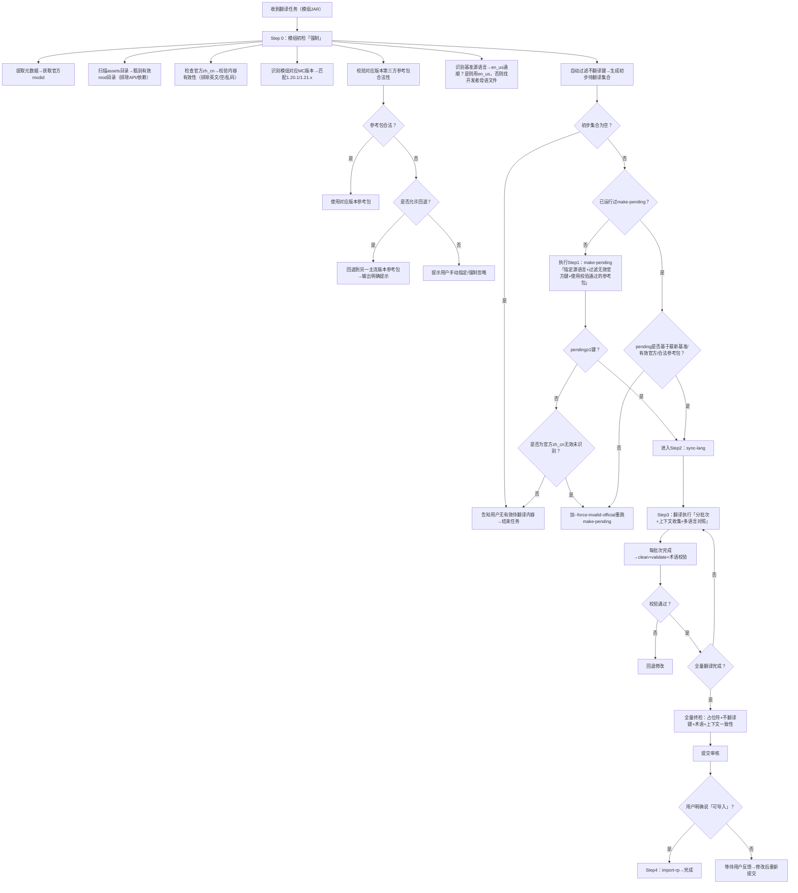

# AGENTS.md - AI 汉化工作指南 v10.1
> **面向对象**：AI 助手（模组）
> **核心目标**：校验参考包合法性 → 识别真正缺失 → 上下文精准翻译 → 安全零冲突导入
> **适配版本**：Minecraft 1.20.1 / 1.21.x 双版本原生支持
> **铁律**：无效官方不算已翻译，占位符不破坏，术语必对齐，未确认不导包，参考包缺失必提示

---

## 目录
1. [核心原则与决策树](#1-核心原则与决策树)
2. [环境准备与术语系统](#2-环境准备与术语系统)
3. [模组翻译全流程](#3-模组翻译全流程)
4. [翻译执行与质量管控](#4-翻译执行与质量管控)
5. [审核交付规范](#5-审核交付规范)
6. [技术参考：算法与脚本](#6-技术参考算法与脚本)
7. [故障排查速查表](#7-故障排查速查表)

---

## 1. 核心原则与决策树

### 1.1 五大铁律（不可违背）
| 原则 | 要求细节 | 违反后果 | 自检命令 |
|------|---------|---------|----------|
| **真正缺失** | 仅翻译「官方zh_cn不存在/内容无效」且「参考包未收录」的键，禁止覆盖有效官方/参考包译文 | 覆盖正确译文引发玩家冲突 | `validate --check-official` 检查是否覆盖有效官方键 |
| **占位符保护** | 严格保留`%[sd]`/`\n`/`§`等格式符，数量、顺序与原文完全一致 | 游戏崩溃、内容显示异常 | `grep -E '%[sd]|\\n|§' zh_cn.json && validate --check-placeholder` |
| **术语对齐** | 同一术语全模组/同系列模组译法完全统一，优先遵循社区约定 | 译名混乱引发玩家困惑 | 对比参考包/根模组`search`结果，生成术语基线 |
| **基准优先** | 若模组源语言非英语，以开发者母语文件为翻译基准，en_us仅作参考 | 译文偏离原作者设定 | `search --source-lang <langcode> <term>` 对照源语言语义 |
| **未审不导** | 必须收到用户明确的「可导入」指令后才能执行导入操作 | 用户无法回滚，信任破裂 | 确认聊天记录中存在明确授权 |

### 1.2 全场景决策树（新增参考包校验分支）

*文本版快速查阅：*
```text
收到任务 → 初检（modid甄别/官方zh_cn校验/模组版本识别/对应版本参考包校验/源语言识别/过滤不翻译键）
  └─ 参考包缺失 → 回退版本/手动指定/强制忽略
  └─ 无待翻译内容 → 结束
  └─ 有待翻译内容 → 执行make-pending
      └─ 同步到工作文件 → 分批次翻译（每批先查上下文）
          └─ 全量校验 → 提交审核 → 用户确认 → 导入
```

---

## 2. 环境准备与术语系统

### 2.1 工作区结构（双版本参考包规范）
```text
~/mods/
├── bin/translation_toolkit.py      # 本工具（v10.1）
├── AGENTS.md                       # 本指南
├── mods/                           # 原始模组 .jar（只读）
├── data/                           # 解压后的原始数据（临时）
│   └── <jarstem>/
│       ├── assets/<modid>/lang/    # 语言文件
│       └── fabric.mod.json/mods.toml # 模组元数据（用于modid/版本甄别）
└── langs/                          # 工作目录（唯一可编辑）
    ├── Minecraft-Mod-Language-Modpack-Converted-1.20.1/  # 1.20.x官方参考包（pack_format=15）
    ├── Minecraft-Mod-Language-Modpack-Converted-1.21.1/  # 1.21.x官方参考包（pack_format=18）
    ├── pending_translation/        # 算法生成的缺口文件
    ├── 农夫乐事根模组翻译参照/      # 根模组术语参考
    ├── <modid>/
    │   ├── zh_cn.json              # 模组工作文件
    │   └── source_notes.md         # 非英语源语言对照笔记（自动生成）
    └── 不翻译键规则.json           # 全局过滤规则（可自定义追加）
```
**新增约定**：
- 两个版本的参考包必须严格遵循上述命名规范，否则自动校验不通过
- 1.21.1参考包兼容全1.21.x版本模组，1.20.1参考包兼容全1.20.x版本模组
- 参考包合法性校验优先级高于所有其他术语规则

### 2.2 固定不翻译键规则（自动过滤+手动校验）
所有满足以下规则的键会在`make-pending`阶段自动剔除，无需翻译，若需临时翻译可手动在pending文件中追加：
1. **后缀匹配**（正则：`\.(author|copyright|version|uuid|url|link|path|id|registry_name|debug|dev)$`）
   - 示例：`mod.farmersdelight.author`、`item.knife.registry_name`
2. **内容匹配**（值满足以下任一条件）
   - 纯数字、纯UUID、纯URL（含http/https）、纯版本号（如`1.20.1`）
   - 纯文件路径（如`textures/item/knife.png`）、纯命令/代码片段
   - 长度≤1的无意义字符（如`" "`、`"-"`）
3. **特殊品类**
   - 所有画作作者键（`*.painting.author`）
   - 开发/调试用键（前缀含`debug.`/`dev.`）
   - 模组元数据ID键（如`mod.id`）

### 2.3 modid甄别规则（多assets目录场景强制）
当assets下存在多个子目录时，按以下优先级确定有效modid，排除依赖/API目录：
1. **最高优先级**：匹配JAR根目录下`fabric.mod.json`/`mods.toml`/`quilt.mod.json`中声明的`id`字段
   - 查看方法：`grep '"id"' data/<jarstem>/fabric.mod.json`
2. 匹配JAR文件名的核心关键词（如JAR名为`farmers-delight-1.20.1.jar`，则modid为`farmersdelight`）
3. 排除含`api`/`lib`/`core`/`library`后缀的目录（此类为依赖库，除非用户明确要求否则无需翻译）
4. 选择lang文件数量最多、同时存在对应`data/`目录的assets子目录

### 2.4 术语对齐策略（适配参考包版本回退）
翻译前必须建立**术语基线**，优先级从高到低：
1. **官方有效中文**：官方zh_cn中内容为通顺中文的条目（内容为英文/空/乱码的条目不计入）
2. **参考包译文**：对应版本CFPA汉化包译法 > 回退版本CFPA汉化包译法 > 自定义参考包译法（社区约定俗成）
3. **根模组对齐**：附属模组优先匹配根模组的术语风格（如农夫乐事附属全部沿用根模组食物译法）
4. **源语言语义**：若源语言非英语，优先匹配源语言的准确含义，en_us仅作参考
5. **跨语言参考**：zh_tw > ja_jp > ko_kr > en_us（en_us降为最低优先级，仅当其他语言无参考时使用）
**回退版本说明**：若使用非对应版本的参考包，需在提交模板中明确说明，避免术语冲突。

---
### 2.5 1.20.1/1.21.x 第三方参考包专项规则
第三方参考包为CFPA团队官方发布的多模组汉化包，是术语对齐的核心依据，目前支持两个主流版本的自动校验与匹配。
#### 2.5.1 合法标准
| 适配MC版本 | 参考包标准目录名 | 要求pack_format | 兼容范围 |
|-----------|------------------|----------------|----------|
| 1.20.x全版本 | `Minecraft-Mod-Language-Modpack-Converted-1.20.1` | 15 | 所有1.20.x模组 |
| 1.21.x全版本 | `Minecraft-Mod-Language-Modpack-Converted-1.21.1` | 18 | 所有1.21.x模组（1.21/1.21.1/1.21.2） |
**必须同时满足以下条件才视为合法参考包**：
1. 目录存在且命名符合上述规范
2. 根目录下存在`pack.mcmeta`，且`pack_format`匹配对应版本
3. 存在`assets`目录，且至少包含100个以上mod的翻译目录
4. 无批量损坏的JSON文件
#### 2.5.2 校验命令
```bash
# 校验指定版本参考包是否合法
python3 bin/translation_toolkit.py validate-pack --version 1.20.1
python3 bin/translation_toolkit.py validate-pack --version 1.21.1
# 合法输出示例：[TK] 1.20.1参考包校验通过，共包含426个模组翻译
# 缺失输出示例：[TK] Error: 1.21.1参考包不存在，可使用--fallback-pack-version 1.20.1回退，或--force-no-pack强制忽略
```
#### 2.5.3 缺失处理方案
当对应版本参考包不存在/不合法时，按优先级选择处理方式：
1. **优先自动回退**：自动切换到另一主流版本的参考包（两个版本术语重合度≥95%，仅少量版本专属物品存在差异），工具会输出明确提示
2. **手动指定**：若有自定义参考包，可通过`--pack-root <路径>`手动指定
3. **强制忽略**：若无需参考包对齐，可加`--force-no-pack`参数，仅基于官方中文生成待翻译集合（需在提交时明确说明）
---

## 3. 模组翻译全流程
### Step 0：模组初检（强制，所有模组必做，新增参考包校验步骤）
```bash
# 1. 提取JAR内容到临时目录
python3 bin/translation_toolkit.py extract-jar mods/<mod>.jar -o data/<jarstem>
# 2. 查找官方modid
grep '"id"' data/<jarstem>/fabric.mod.json # Fabric模组
grep 'modId' data/<jarstem>/META-INF/mods.toml # Forge模组
# 3. 识别模组对应MC版本
python3 bin/translation_toolkit.py detect-version mods/<mod>.jar
# 输出示例：[TK] 模组版本识别为1.21.1
# 4. 校验对应版本参考包合法性
python3 bin/translation_toolkit.py validate-pack --version <识别到的版本>
# 5. 校验官方zh_cn有效性
python3 bin/translation_toolkit.py validate data/<jarstem>/assets/<modid>/lang/zh_cn.json --check-official
# 输出含「无效内容X条」则说明官方zh_cn存在英文/空/乱码
# 6. 识别源语言
# 若en_us明显机翻，扫描assets/lang下其他语言文件，找到通顺的源语言（如ru_ru/ja_jp）
python3 bin/translation_toolkit.py search data/<jarstem>/assets/<modid>/lang/ja_jp.json "" --scope value | head -10
```
**初检完成标志**：明确有效modid、模组版本、参考包使用方案、官方zh_cn有效性、基准源语言。

---
### Step 1：生成真正缺失（v10.1算法更新，新增参考包相关参数）
**核心逻辑**：仅保留「基准源语言有、官方有效中文没有、参考包没有、不属于不翻译键」的条目
```bash
# 标准执行（自动识别版本+校验参考包+自动回退+过滤无效官方键）
python3 bin/translation_toolkit.py make-pending "mods/<mod>.jar" --modid <modid>
# 官方zh_cn全为英文/空，强制视为无效
python3 bin/translation_toolkit.py make-pending "mods/<mod>.jar" --modid <modid> --force-invalid-official
# 禁用参考包版本回退，对应版本参考包不存在则直接报错
python3 bin/translation_toolkit.py make-pending "mods/<mod>.jar" --modid <modid> --no-pack-fallback
# 手动指定参考包版本（忽略自动识别的模组版本）
python3 bin/translation_toolkit.py make-pending "mods/<mod>.jar" --modid <modid> --pack-version 1.20.1
# 强制不使用任何参考包，仅对比官方中文
python3 bin/translation_toolkit.py make-pending "mods/<mod>.jar" --modid <modid> --force-no-pack
# 源语言非英语，指定基准源语言（如日语ja_jp）
python3 bin/translation_toolkit.py make-pending "mods/<mod>.jar" --modid <modid> --source-lang ja_jp
```
**成功标志（含参考包状态提示）**：
```
[TK] 模组版本识别: 1.21.1
[TK] Warning: 1.21.1参考包不存在，自动回退到1.20.1参考包，术语可能存在少量差异
[TK] pending(final): langs/pending_translation/<modid>.json (42 keys)
[TK] 自动过滤不翻译键: 12条
[TK] 过滤官方无效中文键: 24条
[TK] 基准源语言: ja_jp
[TK] 参考包使用: 1.20.1（回退）
```
*若显示0 keys，需先校验是否为官方zh_cn无效未识别，确认后再决定是否结束任务。*

---
### Step 2：同步到工作文件
```bash
python3 bin/translation_toolkit.py sync-lang <modid>
```
**行为说明**：
- 若基准源语言非英语，自动生成`langs/<modid>/source_notes.md